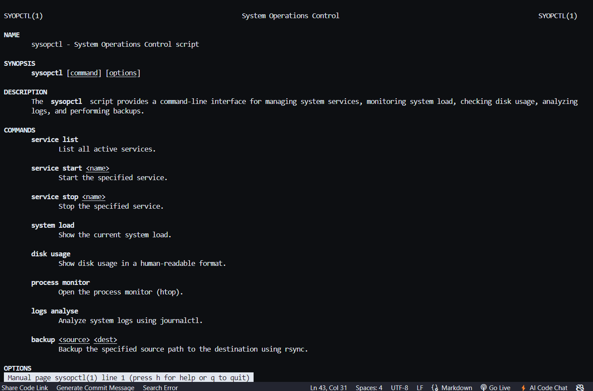
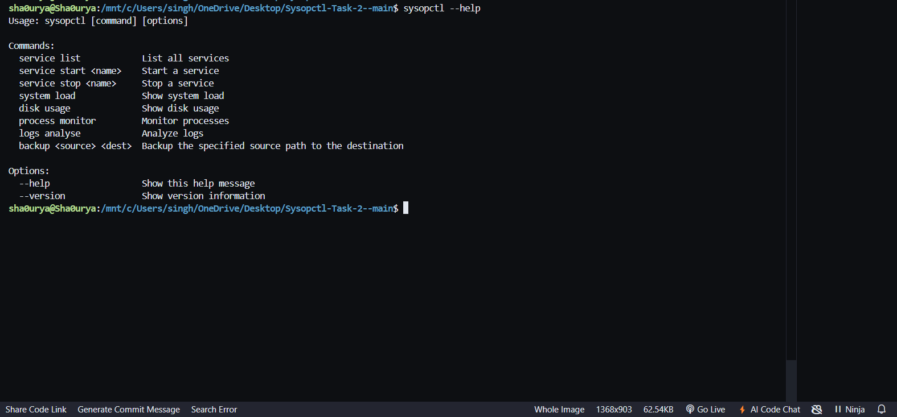
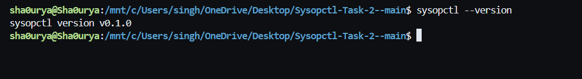
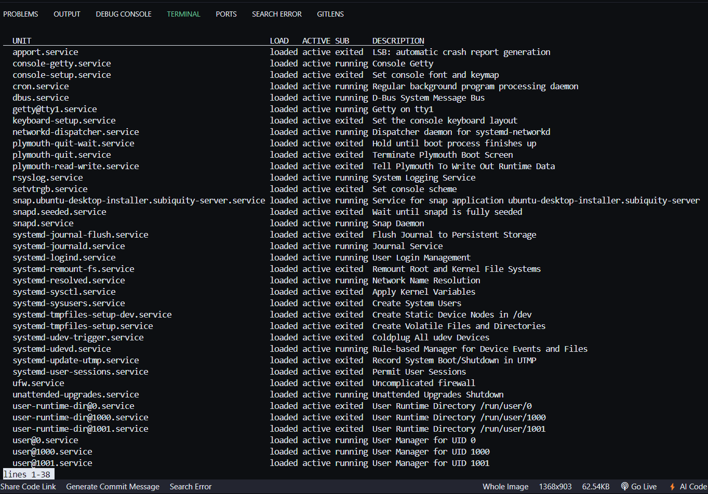
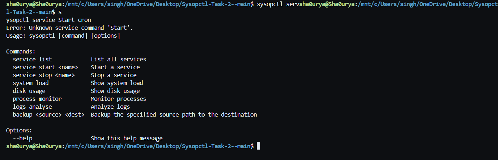
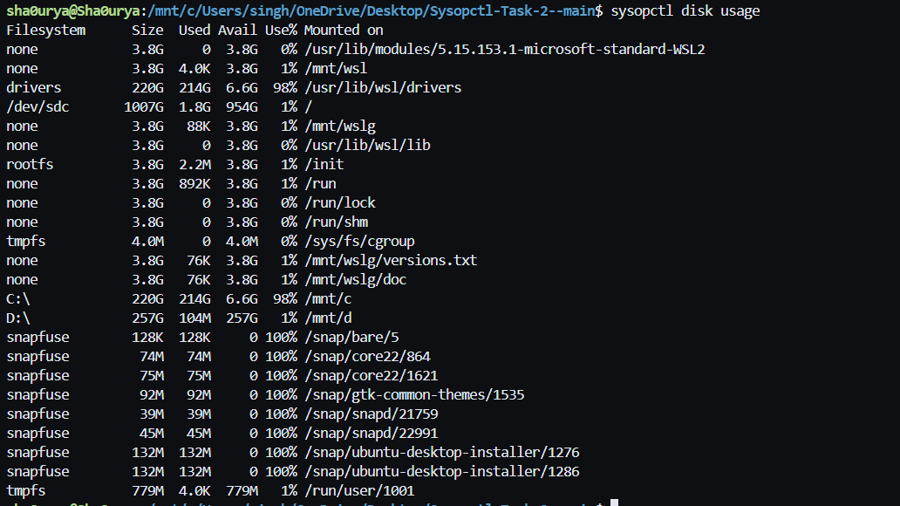
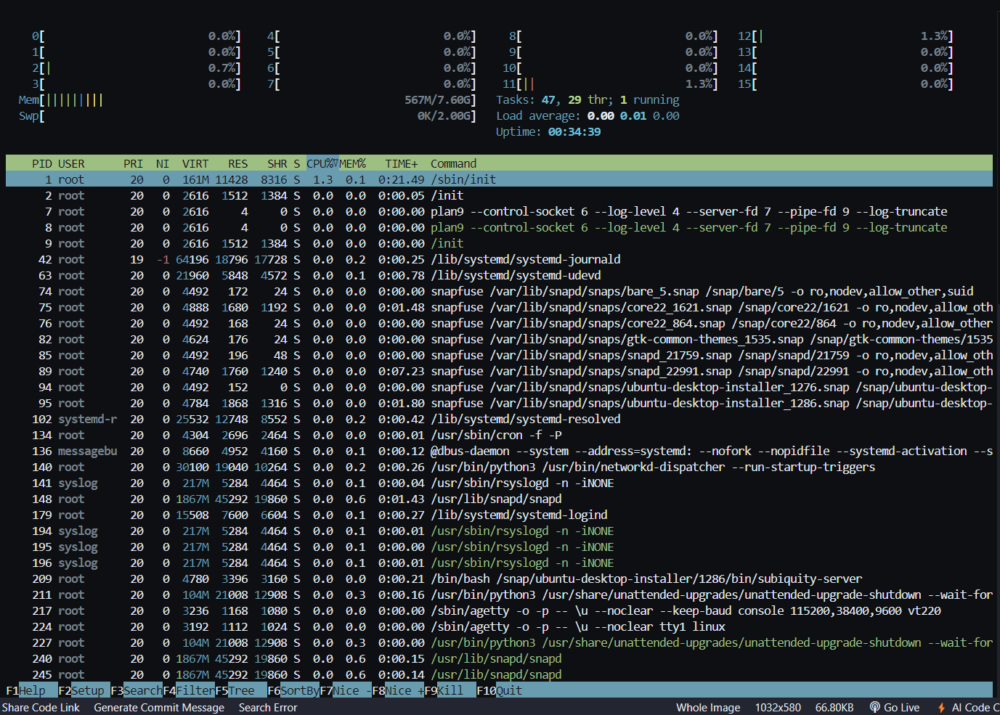
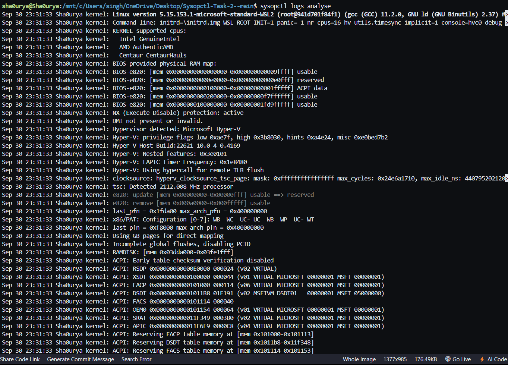
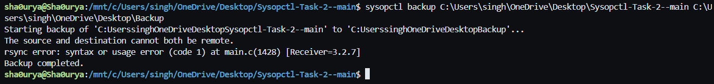

# `sysopctl` Command Documentation

**Version:** v0.1.0

## Introduction
`sysopctl` is a command-line tool designed for managing various system operations. It provides users with an easy-to-use interface for interacting with system services, monitoring processes, analyzing logs, and performing system backups. This tool aims to simplify common system administration tasks, offering functionality similar to other Linux commands like `systemctl`, `uptime`, `df`, `top`, `journalctl`, and `rsync`.

## Usage
All commands follow the general syntax:

```
sysopctl <command> [options]
```

<!-- Installation of Sysopctl -->

### Basic Commands

#### 1. Manual Page
To access the full documentation through the manual:

```
man sysopctl
```


#### 2. Help Option
To display usage information and examples:

```
sysopctl --help
```



#### 3. Version Information
To display the current version of the `sysopctl` command:

```
sysopctl --version
```



### System Management Operations

#### Part 1: Easy Level

##### 1. List Running Services
Lists all active services on the system, similar to `systemctl list-units --type=service`.

**Command:**
```
sysopctl service list
```



##### 2. View System Load
Displays the current system load averages, similar to the output from the `uptime` command.

**Command:**
```
sysopctl system load
```


#### Part 2: Intermediate Level

##### 1. Manage System Services
Starts or stops a specific service, akin to using `systemctl start/stop`.


**Start a Service:**
```
sysopctl service Start <service-name>
```
**Stop a Service:**
```
sysopctl service stop <service-name>
```



##### 2. Check Disk Usage
Displays disk usage statistics by partition, similar to `df -h`.

**Command:**
```
sysopctl disk usage
```



#### Part 3: Advanced Level

##### 1. Monitor System Processes
Monitors real-time process activity, similar to the `top` or `htop` commands.

**Command:**
```
sysopctl process monitor
```



##### 2. Analyze System Logs
Analyzes and summarizes recent critical log entries, utilizing tools like `journalctl`.

**Command:**
```
sysopctl logs analyse
```



##### 3. Backup System Files
Initiates a backup of specified files or directories, potentially using `rsync` for file transfers.

**Command:**
```
sysopctl backup <path>
```



